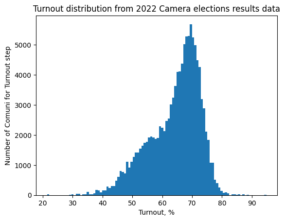
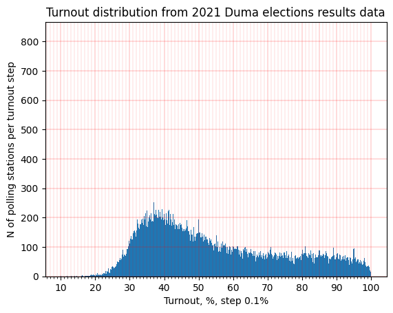
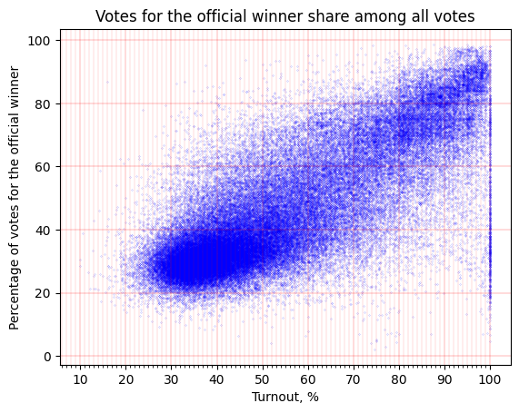
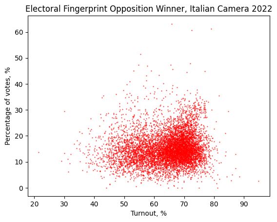
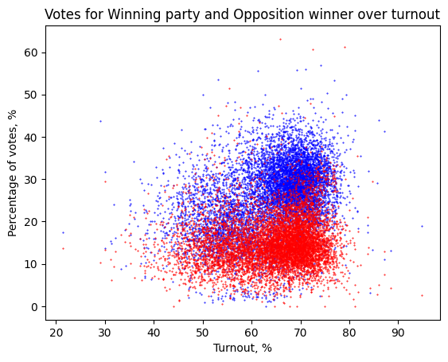

# Open Voting

## Introduction

In this project, we examine open data in the public domain for two countries: Italy and Russia. Specifically, we focus on the most recent Italian parliamentary election results and the latest Russian Duma (parliamentary) elections. These elections represent significant political campaigns in their respective countries.

Our objectives are:

- To analyze the importance and potential issues surrounding open electoral data.
- To highlight transparency and ethical concerns in data collection, processing, and publication.
- To compare practices in both nations while addressing shared challenges.

The objectives of our project involve reflecting on the importance and potential issues surrounding open data in the public domain. Through our research, we aim to elucidate the subsequent aspects:

1. **Open Data Limitations**: While the availability of open data is a step towards transparency, it is not sufficient to ensure the integrity of the electoral process. If the underlying procedures are corrupted or problematic, merely publishing the data online does not legitimize the process.

2. **Value of Open Data**: Despite potential corruption, the presence of open data allows for some level of scrutiny. By analyzing the data, we can identify certain manipulations and, to some extent, deduce what the real, uncorrupted results might have been. This highlights the importance of open data in tracing fraud and promoting accountability.

3. **Challenges in Fraud Detection**: While some electoral fraud can be detected and analyzed, other types may remain hidden. Nonetheless, a high degree of certainty about their occurrence can often be established. This underscores that while open data is beneficial, it alone cannot guarantee an unproblematic procedure or a healthy society.

Through our analysis, we aim to illustrate that open data, while not a panacea, is crucial for transparency and accountability in electoral processes.

## Scenario

To achieve our objectives, we collect and analyze electoral data with the finest granularity available. 

For **Italy**, we found data at the “comune” (roughly translated as municipality) level (~94,000 entities) on official websites, resulting in a dataset with (~117,594 rows) for Camera dei deputati and (~117,611 rows) for Senato, which makes a few thousand rows for each commune.

For **Russia**, we accessed data at two levels:

Polling Stations (УИК): This level (~94,000 entities) represents the finest granularity available, where data includes votes for political parties such as КПРФ (Communist Party) and ЕР (United Russia), as well as voter turnout and total registered voters. Additionally, geographic coordinates (latitude and longitude) for each polling station enable spatial analysis.
Territorial Commissions: This aggregated level (~3,000 entities) provides summaries of election results across groups of polling stations.
The Russian dataset was obtained from Sergey Shpilkin, who scraped and preprocessed the data from the official ЦИК website. While ЦИК provides only HTML tables, the processed CSV format allows for easier integration into our analysis.

For consistency and comparability, we primarily focus on the municipality level of granularity where applicable, using polling stations (УИК) as a counterpart to communes in Italy.

Our analysis involves a comprehensive examination of the data to identify anomalies and potential manipulations. We employ statistical methods and data visualization techniques to illustrate our findings. This approach allows us to demonstrate the strengths and limitations of open data in uncovering electoral fraud and promoting transparency.

By the end of this project, we aim to provide a clear understanding of the role of open data in electoral processes, highlighting both its potential and its limitations. This understanding is crucial for developing strategies to enhance transparency and integrity in elections worldwide.

### Italy Dataset Overview

**Data Source**:
The dataset for the latest Italian parliamentary election (2022) was obtained from the Official Italian Government Election website, accessible at https://elezioni.interno.gov.it/. It is not clear if it’s more related to the Ministry of the Intern (Ministero dell’Interno) or to the government itself.

**Granularity**:
From a geographical point of view the data is provided at the commune level. The current format presents a challenge as each commune has multiple rows, with each row representing a different candidate. To facilitate analysis, the data needs to be reformatted such that each row corresponds to one commune's electoral results.

**Data Format**:
The available data is provided in spreadsheet format (csv), which has been converted into .txt files for further analysis.

#### Columns Description:

1. **"DATAELEZIONE"** - Date of the election
2. **"CODTIPOELEZIONE"** - Election type code (C for Camera, S for Senato)
3. **"CIRC-REG"** - Regional electoral district
4. **"COLLPLURI"** - Collegio Plurinominale
5. **"COLLUNINOM"** - Colleggio Uninominale
6. **"COMUNE"** - Comune name
7. **"ELETTORITOT"** - Total electorate
8. **"ELETTORIM"** - Male electorate (you can of course infer the Female votants with a simple operation but we found it somehow biased)
9. **"VOTANTITOT"** - Total votes cast
10. **"VOTANTIM"** - Male votes cast
11. **"SKBIANCHE"** - Blank votes
12. **"VOTILISTA"** - Party votes
13. **"DESCRLISTA"** - Party name
14. **"COGNOME"** - Candidate's last name
15. **"NOME"** - Candidate's first name
16. **"LUOGONASCITA"** - Candidate’s place of birth
17. **"DATANASCITA"** - Candidate’s date of birth
18. **"SESSO"** - Candidate’s Sex (described as a binary variable, in some context can be considered not politically correct)
19. **"VOTICANDIDATO"** - Candidate votes’

#### File Structure:
Separate folders are provided for Senate and Camera voting. Notably, in the Camera folder, files include:
- Camera_VAosta_livComune_Scrutini.txt
- Camera_VAosta_LivComune.txt
- Camera_Italia_LivComune.txt

Similarly, in the Senate folder, additional files include:
- Senato_VAosta&Trentino_livComune_Scrutini.txt
- Senato_VAosta&Trentino_LivComune.txt
- Senato_Italia_LivComune.txt

These distinctions might be due to the unique administrative divisions of Valle d'Aosta or some peculiar way of collecting the data they had that made this necessary.

### Russia Dataset Overview
Russia Dataset Overview
Data Source:
The dataset for the latest Russian parliamentary elections (Duma elections) was derived from data scraped by Sergey Shpilkin, a well-known electoral statistician, from the official ЦИК (Central Election Commission) website. While the official data is provided only in HTML table format, Shpilkin’s preprocessing converted it into CSV files suitable for analysis.

Granularity:
The data is available at two levels:

Polling Station Level (УИК): Representing approximately 94,000 entities, this is the most granular level. Each row corresponds to a single polling station, capturing detailed election metrics such as voter turnout, total registered voters, and votes for individual political parties.
Territorial Commission Level: An aggregated view of election data summarized across ~3,000 territorial commissions, grouping multiple polling stations into larger administrative units.
Data Format:
The dataset is provided in CSV format, which has been processed to facilitate statistical analysis and visualization.

#### Columns Description:
1. "REGION" - Name of the administrative region (e.g., Moscow, Saint Petersburg).
2. "TERRITORY" - Name of the territorial commission.
3. "UIK_ID" - Unique identifier for the polling station (УИК).
4. "REGISTERED_VOTERS" - Total number of registered voters at the polling station.
5. "TURNOUT" - Total voter turnout at the polling station.
6. "BLANK_VOTES" - Number of blank votes submitted.
7. "INVALID_VOTES" - Number of invalid or spoiled votes.
8. "PARTY_A_VOTES" - Votes for Political Party A (e.g., United Russia).
9. "PARTY_B_VOTES" - Votes for Political Party B (e.g., Communist Party).
10. "OTHER_PARTY_VOTES" - Combined votes for all other parties.
File Structure:
The dataset is organized into a single CSV file containing polling station-level data. Territorial commission data is summarized within the same file, using aggregation methods.

Notable preprocessing steps include:

Normalization: Ensuring uniformity in naming conventions for regions and territories.
Data Cleaning: Addressing inconsistencies such as missing values or duplicate entries.
Derived Columns: Adding calculated metrics such as turnout percentage and vote shares for individual parties.
The dataset’s structure and granularity allow for robust statistical analysis, including spatial visualization and anomaly detection. By incorporating both polling station and territorial commission levels, we can compare trends across different administrative hierarchies.

**Data Source**:
The dataset pertains to the latest Russian parliamentary elections (Duma elections).  While the data is theoretically accessible from the Official Russian Government [Election website](http://www.krasnodar.vybory.izbirkom.ru/region/izbirkom?action=show&root=1&tvd=100100339411198&vrn=100100339410030&prver=0&pronetvd=null&region=4&sub_region=4&type=226&report_mode=null), it poses challenges for comprehensive extraction due to website formatting issues and captchas blocking data parsers.

**Complications in Data Retrieval**:
- The data is stored in separate HTML tables for each polling station or 'municipal aggregation'/'territorial commission' of polling stations.
- Captchas and minor formatting techniques hinder automated data parsing efforts.
- Original websites accessible only from Russian IP addresses 

**Data Collection Method**:
To overcome the challenges related to the data collection, we utilized datasets preprocessed and scraped by Sergey Shpilkin, a prominent electoral statistician known for his work in identifying anomalies in Russian elections. Shpilkin's processed CSV files offer a structured and cleaned version of the data, enabling detailed analysis without the technical hurdles associated with direct data extraction from the ЦИК website.

#### Dataset Composition:
The dataset consists of multiple .csv files:
1. **Polling Station Level Data**: Granularity at the level of individual polling stations.
2. **Territorial Commission Level Data**: Aggregated data covering several polling stations within a 'territorial commission,' roughly equivalent to a municipality.
3. **Regional Level Data**: Data aggregated at the regional level.
4. **Remote Voting Data**: Data pertaining to remote voting, where votes were registered online rather than on paper ballots.

#### Focus and Analysis:
The primary focus is on the second file (Territorial Commission Level Data) to maintain consistency with the granularity of the Italian dataset. However, a closer examination of the first file (Polling Station Level Data) may be necessary to detect specific anomalies or irregularities.

## Legal Analysis

**Italy**:

**Privacy**:
The only real issue with Italian data is related to municipalities with too few inhabitants, from this dataset it is possible to infer with a high probability voting trends, some cases are evident like Monterone with a population of 34. In general Municipalities with 100 or less inhabitants are 70 in Italy, this can, in fact, represent a major privacy issue that goes against the art. 48 of the Italian Constitution, that protects the privacy of the vote.

The only real issue with Italian data is related to municipalities with very few inhabitants. From this dataset, it is possible to infer with a high probability the voting trends of individuals. Some cases are evident, such as Monterone, with a population of just 34. In general, municipalities with 100 or fewer inhabitants number around 70 in Italy. This represents a significant privacy concern, potentially violating Article 48 of the Italian Constitution, which safeguards the secrecy of the vote.

**Russia**:

**Privacy**:
For Russian data, privacy issues are somewhat different. The data at the polling station level (~94,000 entities) includes detailed voting records for small precincts, often serving populations as small as a few hundred voters. In rural or sparsely populated areas, this granularity might allow individuals' voting behavior to be inferred, especially if combined with external information about voter turnout or demographics. This could contravene Russian privacy laws, particularly those outlined in Federal Law No. 152-FZ on Personal Data.

To address these concerns:

Any datasets used must ensure anonymity by removing or aggregating data that could identify individual voters.
The use of external preprocessed datasets (such as those provided by Sergey Shpilkin) helps mitigate these risks, as they focus on aggregated results and statistical anomalies rather than individual-level data.
A review of the legal frameworks governing data privacy in both Italy (GDPR compliance) and Russia (Federal Law No. 152-FZ) is essential to ensure ethical and lawful data use.

The only real issue with Italian data is related to municipalities with very few inhabitants. From this dataset, it is possible to infer with a high probability the voting trends of individuals. Some cases are evident, such as Monterone, with a population of just 34. In general, municipalities with 100 or fewer inhabitants number around 70 in Italy. This represents a significant privacy concern, potentially violating Article 48 of the Italian Constitution, which safeguards the secrecy of the vote.

For Russian data, privacy issues are somewhat different. The data at the polling station level (~94,000 entities) includes detailed voting records for small precincts, often serving populations as small as a few hundred voters. In rural or sparsely populated areas, this granularity might allow individuals' voting behavior to be inferred, especially if combined with external information about voter turnout or demographics. This could contravene Russian privacy laws, particularly those outlined in Federal Law No. 152-FZ on Personal Data.

To address these concerns:

Any datasets used must ensure anonymity by removing or aggregating data that could identify individual voters.
The use of external preprocessed datasets (such as those provided by Sergey Shpilkin) helps mitigate these risks, as they focus on aggregated results and statistical anomalies rather than individual-level data.
A review of the legal frameworks governing data privacy in both Italy (GDPR compliance) and Russia (Federal Law No. 152-FZ) is essential to ensure ethical and lawful data use.

**Licensing**:
The License in Italy is, unexpectedly, not clear. The platform we used, the one that provides the general dataset for the elections just labels the collection as “Open Data”, on the other hand with a more accurate research we were able to find another page called “dati.gov.it” that contains Electoral data on the municipality and regional level. Each municipality probably released their data in different open data formats on this website, while the eligendo website published the mashup dataset. 
In “dati.gov.it” we’re able to find a page dedicated to the IODL (Italian Open Data License), our datasets are not explicitly released under this license, but we can infer that they probably are if we consider that both websites are part of the Governement web domain.

For Russian data, the situation is markedly different. The data provided by the Central Election Commission of the Russian Federation (ЦИК) is technically public but not openly licensed in the conventional sense. 

**Purpose**:
Italy is a member of the EU and the Open Data release is probably part of the current implementation of the EU directives on this subject.
In general Italy is considered a democratic country and the release of this kind of data is public interest and in general a fair and good practice.

In Russia, the purpose of data publication is less transparent and is often influenced by different political and administrative priorities. While the Central Election Commission (ЦИК) publishes electoral data, this release is not necessarily driven by a commitment to transparency or democratic accountability. Instead, the publication may be motivated by procedural requirements or the need to project an image of openness.

However, independent efforts, such as those by Sergey Shpilkin, emphasize the importance of analyzing and interpreting this data to identify electoral anomalies. These analyses aim to enhance transparency and provide insights into the electoral process, often highlighting discrepancies that may indicate irregularities. While the Russian government’s commitment to truly open data practices remains questionable, the availability of this data, even in its constrained form, enables third-party analysis and fosters a limited level of public scrutiny.

## Ethics Analysis

**Italy**:

These are very institutional datasets, related to the most important moment of a functioning democracy, it records a very large audience and the data collection must be as secret and anonymous as possible in full respect of the Italian Constitution. Nevertheless it’s possible to trace and identify some prejudices and biases that affect the way the dataset is designed, the most problematic are related to sex and gender:
the choice of recording the “gender” of the candidate as a binary variable (M/F) is certainly not free of concerns in an everchanging cultural and social landscape 
Same goes with the distinction of male voters from the total (we have two columns, one for total votes, the other recording male votes). In this case we need a further task (a simple subtraction) to find the correct number of female voters and yet it’s not justifiable stating that another column would’ve been cumbersome for the dataset. If we always need a further task, why not inferring the total voters number by the sum of male and female voters?

**Russia**:

As for the Russia's 2021 Duma elections data, several ethical question can be posed such as that of trustworthiness of institutions: In a context where democratic institutions are widely questioned, can the data provided by government sources be trusted at face value? How should researchers balance skepticism with the need to work with the available data?
Furthermore, does engaging with data provided by a state accused of undermining democracy inadvertently legitimize that state’s narrative? Researchers must carefully navigate the ethics of analyzing potentially manipulated datasets without reinforcing government claims of transparency.  

On top of that, dealing with such socio-political mechanisms as elections, not only the data and the elections count, but their inamge in the public opinion as well. For Russia's dataset, that leads to further dilemmas for researchers in the context of public perception and misinformation
- Public Trust: How does the public perceive the credibility of the dataset? Is there a widespread belief that the data is manipulated, and how does this impact civic engagement?
- Potential for Misuse: Could the dataset be used to spread misinformation, such as selectively highlighting patterns that appear to validate fraudulent results or discredit legitimate opposition?

## Technical Analysis (Formats, Metadata, URI, Provenance)

**Italy**:

The file extension for the italian dataset is .txt, probably to allow easier interoperability and readability on any machine. The format is a csv that uses semi-columns (;) as separators, this latter choice is odd, because it is not the most common way of separating cells in a csv and can lead to some errors during import and reading in certain analysis context.
The metadata is scarce and not adequate for a dataset that carries this prominence, it’s not easy to find column descriptions that allow us to immediately understand the content, leading to time consuming inference tasks.
There’s no real URI because the files are published as downloadable .zip archives (we will provide a URI for the raw files uploading them on github).
The provenance is not stated, all we know is that the website is inserted in the government web domain, so it’s at least trustable. 

**Russia**

While the official data is originally provided in HTML table format, Shpilkin’s preprocessing converted this data into CSV files, making it more suitable for analysis.

**Formats**:

The dataset is provided in CSV format, a widely-used format that facilitates statistical analysis and interoperability with many tools and software. The use of CSV ensures that the dataset is compatible with various platforms for analysis and visualization. 

**Metadata**:

The metadata in this dataset is limited but essential for understanding its structure. The columns are labeled clearly, and the file includes some derived metrics, such as turnout percentages and vote shares for individual parties. However, detailed metadata regarding the data collection process, sources of potential bias, and the specific methodology used to preprocess and clean the data is not explicitly documented. Users must rely on the dataset’s structure and their own analysis to infer the meanings of various columns and how the data was aggregated.

**URI**:

The dataset itself does not come with a direct URI, as the data is originally published by the ЦИК in HTML table format and then converted into CSV files by Sergey Shpilkin. To ensure long-term access and stability, we will upload the CSV files to our public GitHub repository such, from where users can directly access the data via a stable URI.

**Provenance**:

While the ЦИК is a government institution, the provenance of this dataset is somewhat complex, as it involves external preprocessing. The dataset’s trustworthiness is tied to the reliability of both the ЦИК and Shpilkin’s methods in processing and presenting the data.

## Sustainability of the Update of the Datasets Over Time

**Italy**:
Being the elections clearly positioned in time the website is able to be constantly up to date with all the different elections that take place in Italy each year (the website serves as platform to get data about all kind of elections that take place on national territory).

**Russia**:
The sustainability of the dataset's updates relies on the availability and continuity of Sergey Shpilkin's Telegram channel as the primary source of the data. Unlike Italy, where the data comes directly from a government-maintained official platform, in Russia, there is no centralized or officially endorsed platform for this data in a usable format. This introduces a potential risk to long-term sustainability if the channel's updates cease or if access to historical data is restricted. Therefore, ensuring periodic archiving of the data from the channel is critical to maintaining the dataset's relevance over time.

## Visualization and Analysis

To approach the analysis we decided to take a look at the current literature and techniques adopted to identify electoral fraud, a strong reference and inspiration comes from this [paper](https://www.pnas.org/doi/10.1073/pnas.1210722109) (Klimek et al., 2012).
For Italy we decided to stick to the Camera Elections, being more representative and therefore granular.

The first graph here is an histogram about the turnout in Italy (eligible voters vs actual voters for percentual step). We can observe that the highest spikes are around the 60-70%, reflecting the actual turnout average for 2022 Elections that was around 63%. The graph looks normally distributed in a bell shape which is probably already a signal of absence of fraud. 

Although we do see some clear asymmetry on the graph, due to having one evident peak, and rather rapid falls on the sides, the assymetry might rather indicate complex socio-demographical factors of the Italian society as well as the political situation at that time, rather than a potential fraud. 

The counterpart graph for the Russia's Parliament 2021 election, looks different. The working hyphothesis is that, in a society without any socio-demographic and political anomalies, we are expecting a symmetrical bell-shape normally distributed graph: most polling stations just randomly happen to host the most popular turnout rate, very few polling stations would randomly get very popular, and very few polling stations would randomly happen to host very few people. In real world the socio-demographic factors make perfect symmetry impossible, but the graph we observing here turns into an almost perfect plateau from ~ 65% to 95% turnout, which looks surprising at least. 

It is also worth noticing that the spikes of the graph don't seem to be random. In fact, we can see that most spikes happen to be positioned at round turnout percentages, which doesn't happen that often naturally either. Let's illustrate this by combining the graph with a scale of integer turnout range

Starting from here we take a look at the so called Electoral fingerprint, it is in the end a scatter plot that shows each data point against turnout and vote percentage. The usual approach is to isolate the winning party and take a look at the shape, the more skewed to the top-right angle it is the more there's a risk of fraud. For italy we selected only the most voted one, Fratelli D'Italia (Brothers of Italy) to avoid problems of repetition and noise.
Higher percentages of turnout and relatively higher votes provide a peculiar shape that will be observed further, the usual interpretation is that to higher turnouts correspond an uncontrolled "stuffing" of the ballot boxes, leading to some data points that have both 100% turnout and 100% votes for the winning party that we can easily infer as impossible.

Let's now consider the electoral fingerprint from the Duma elections. Here we will take a look at the fingerprint of the winning party Единая Россия (Edinaya Rossiya / "United Russia") Again, in a perfectly normal social/political/demographic situation we would expect a perfect ellipsis on such plot: the party is expected to get +- their final result on a random polling station, no matter how many people came to this polling station. 

The fact that the ellipsis could be oriented sligtly diagonally could be explained by complex socio-demographic mechanisms in the society (e.g. more politically motivated voters mught gravitate towards one party over another). However, seeing this many data points skewed to the corner of the graph seems very hard to explain by any natural reasons. 

Here too, not only we can see an absolute abnormality of the plot, but also at the very corner we can see a prominent spot with rectangular data patterns around all the round turnout percentages and voting rates, suggesting the data manipulation. 

In the following graph we can see how it went for the opposition winner in Italy (Democratic Party), we can then checkout, in the subsequent, the winning and the opposition winner in two different colors, allowing us to receive an interesting picture of the election. We can clearly see that the final fingerprint graph looks without many outliers and not so skewed, as we mentioned before this can be a signal that no fraud was enacted in Italy. 

Let's consider the electoral fingerprints of the winning party at the 2021 Duma election -- Edinaya Rossiya (in blue), and the most successful opposition party at those elections KPRF (Communist Party of the Russian Federation, in red). Here we can see almost perfect vertical symmetry of the votes, suggesting that a huge number of the stations where KFRF lost, coincide with the data points of the highest turnout, where the nature of the data points is hard to explain other than by a large manipulaion of the data points, injecting invented numbers into the data, often at round numbers.

## RDF

The following link lead to the produced RDF graphs for the italian and russian datasets, and some linked interesting resources that are connected to them.

In particular for Italy we also pointed to the institutional website that releases open data on every italian election, Eligendo, as a data service and we decided to implement an RDF represantation that takes account of the italian standard for DCATAP.

[Italian RDF](https://raw.githubusercontent.com/falaimo99/open-voting/refs/heads/main/DCAT-AP_IT-IT.ttl)

[Russian RDF](https://raw.githubusercontent.com/falaimo99/open-voting/refs/heads/main/DCAT-AP-RU.ttl)
